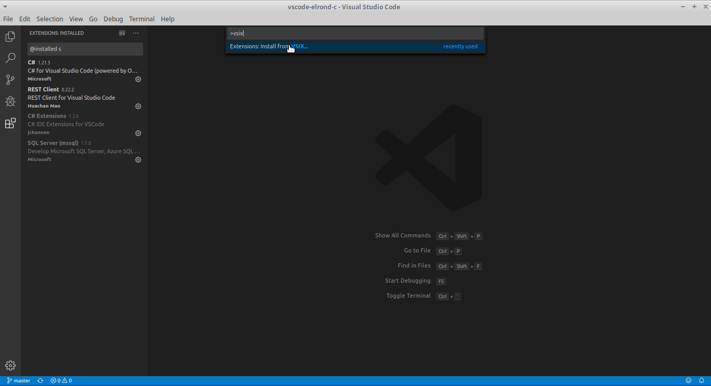
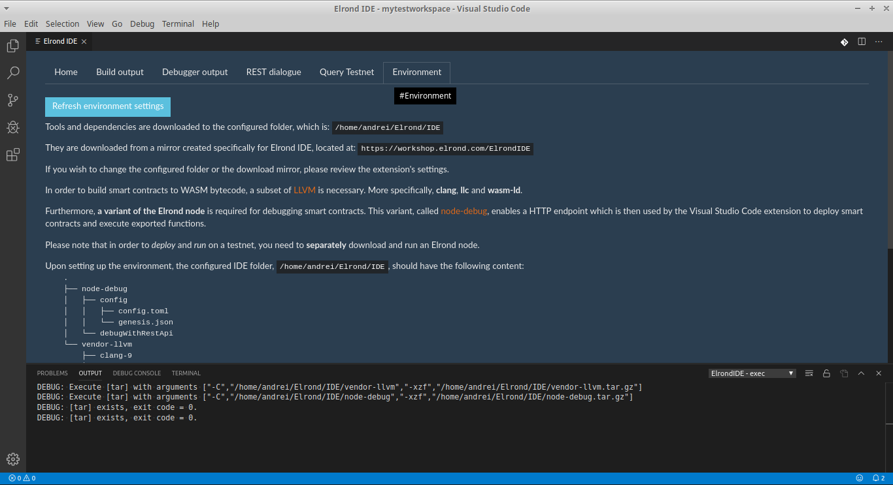
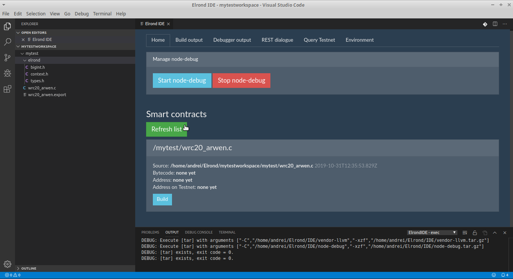

# San Francisco Blockchain Week 2019 Workshop

## Part 1: become a validator on a sandboxed Elrond Testnet:
### Become a validator when running a linux OS:
```
sudo apt-get install git -y
git clone https://github.com/ElrondNetwork/elrond-go-scripts --single-branch --branch sf2019
cd elrond-go-scripts/ubuntu-amd64/
./install.sh
```

### Become a validator when running a Mac OS:
```
git clone https://github.com/ElrondNetwork/elrond-go-scripts --single-branch --branch sf2019
cd elrond-go-scripts/darwin-amd64/
./install.sh
```

When prompted to enter a name just add a custom string and then you can start the node by choosing the option `front`
The credentials are generated automatically and, by default, each new node will join the network as observer on shard 0. 


### What the install.sh script does

The following script lines download a github repo containing bash script that does the following:
1. Install prerequisites like git, curl and wget (if missing);
1. Download from https://github.com/ElrondNetwork/elrond-go/releases/tag/sf2019-1 required tar.gz archive file that contains the following binaries: 
      - node - the elrond-go node binary;
      - keygenerator - a simple tool to generate cryptographic credentials;
      - libwasmer_runtime_c_api binary used by the Arwen VM.
1. The script also clones a config repo from here: https://github.com/ElrondNetwork/elrond-config/tree/sf2019 that contain all required config files for the node binary to connect to the rest of the network;
1. Please note that libwasmer_runtime_c_api binary si copied in /usr/lib (or /usr/local/lib in Mac OS) so that operation requires elevation.

###


## Part 2: Developing SmartContracts:

1) Download and install VSCode from here: https://code.visualstudio.com/download

2) Download latest released VSIX file (Visual Studio Code extension):
https://github.com/ElrondNetwork/vscode-elrond-c/releases/

3) Install VSIX file in vscode.
`Ctrl+Shift+P`, command `Install from VSIX`. Select the downloaded VSIX file. Install, restart vscode.



4) Adjust settings: `Ctrl+Shift+P`, command `open settings (UI)`. Search for `elrond*` settings. They are as follows:

- Elrond - download mirror: `https://workshop.elrond.com/ElrondIDE`
- **Elrond - IDE folder**: `/home/someone/Elrond/ide`
- Elrond - rest api port: `8080`
- Elrond - testnet URL: `https://wallet-workshop.elrond.com`

**You only need to set `Elrond - IDE folder`. Note that dependencies will be downloaded to this folder.** 


5) In Visual Studio Code, open a folder (workspace). This is where development of smart contracts will take place. `Ctrl+Shift+P`, command `Open Folder`.

6) Open **Elrond IDE**: `Ctrl+Shift+P`, command `Elrond - open IDE`.


7) Go to tab **Environment**, and install dependencies (automatically):
- A subset of [LLVM](https://llvm.org) suite (`clang`, `llc`, `wasm-ld`).
- [elrdon-do-node-debug](https://github.com/ElrondNetwork/elrond-go-node-debug), a lightweight version of the Elrond node, necessary for smart contract development.

**All these will be installed in the configured IDE folder.**




Upon setting up the environment, the configured IDE folder should have the following content:

```
    .
    ├── node-debug
    │   ├── config
    │   │   ├── config.toml
    │   │   └── genesis.json
    │   └── debugWithRestApi
    └── vendor-llvm
        ├── clang-9
        ├── llc
        ├── lld
        └── wasm-ld
```

8) Create a smart contract from an existing list of prototypes (templates). `Ctrl+Shift+P`, command `Elrond - create smart contract from prototype (template)`.


You will be asked to pick the prototype (template) from a list of given prototypes. Choose `erc20-c`.


Then, you shall provide a name for the smart contract subproject.


In the end, a folder is created for you in the workspace.


9) Go to **Home** tab. Hit **Refresh** to list the `.c` smart contracts in the workspace.



You should see the newly created smart contract project in the list.

7) Hit "Build" to obtain the WASM bytecode.


8) Go to "Build output" to inspect the logs.


9) Start node-debug.


10) Deploy the smart contract on node-debug.


11) Inspect the address of the smart contract.


12) Inspect the output of node-debug.


13) Inspect the REST dialogue between the vscode extension and the HTTP endpoint of node-debug.


14) Run a function exported by the smart contract.

15) Inspect the output (vmOutput) of run.

16) Start a node on the testnet.
./node


17) Hit "deploy on testnet" and choose the appropriate private key file. Then hit "deploy".


18) Inspect the address of the smart contract.


19) Run a function on the testnet. Don't forget to choose the appropriate private key file.


20) Inspect balance of the account that ran the function.
Open testnet explorer and check account balance
