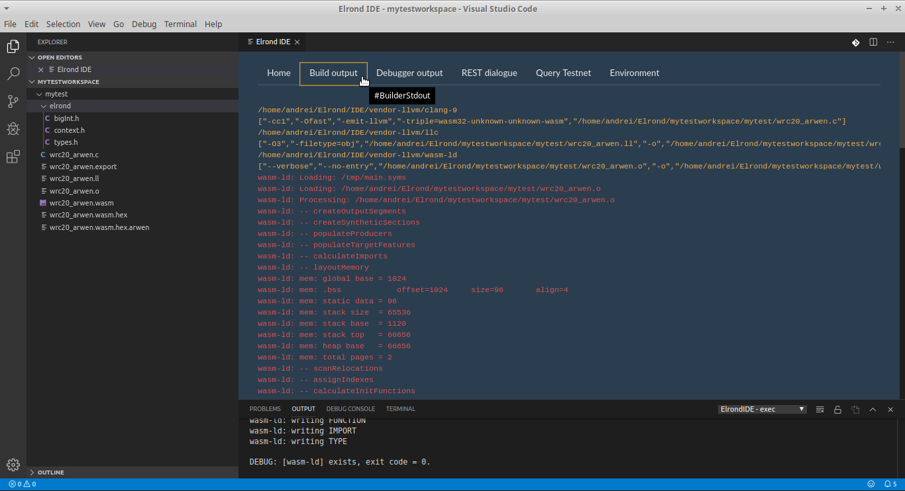
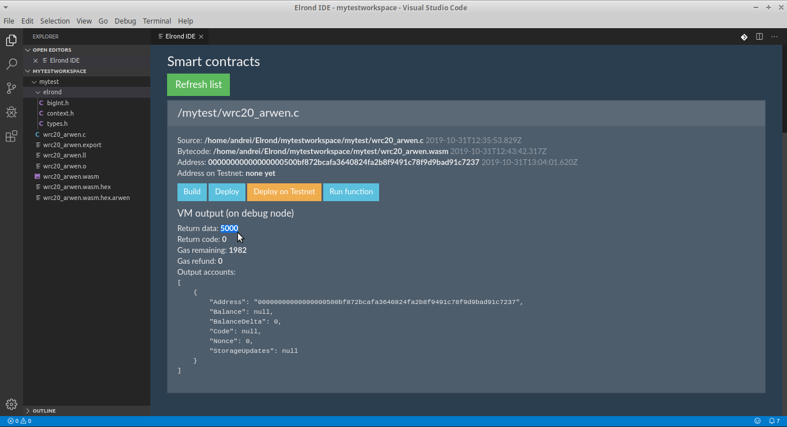
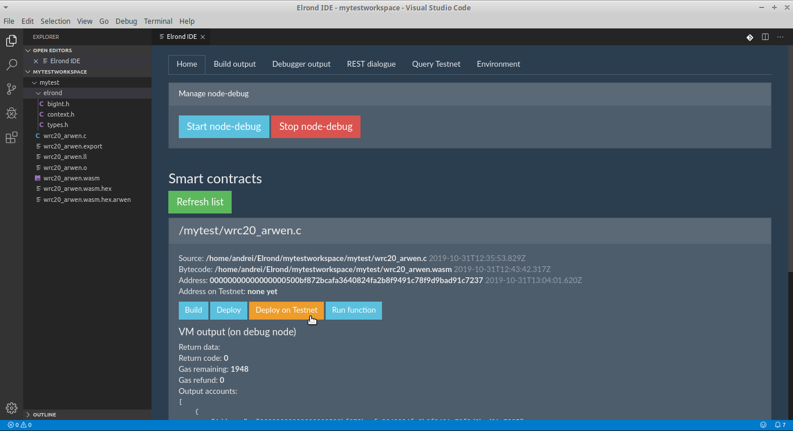
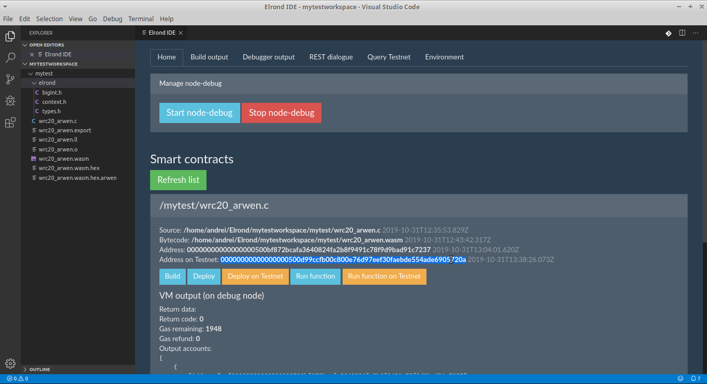
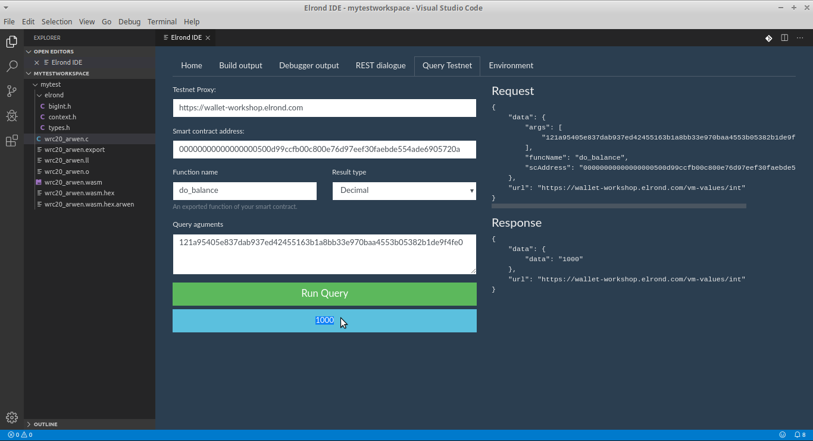

# San Francisco Blockchain Week 2019 Workshop

## Part 1: become a validator on a sandboxed Elrond Testnet:
### Become a validator when running a linux OS:
```
sudo apt-get install git -y
git clone https://github.com/ElrondNetwork/elrond-go-scripts --single-branch --branch sf2019
cd elrond-go-scripts/ubuntu-amd64/
./install.sh
```

### Become a validator when running a Mac OS:
```
git clone https://github.com/ElrondNetwork/elrond-go-scripts --single-branch --branch sf2019
cd elrond-go-scripts/darwin-amd64/
./install.sh
```

When prompted to enter a name just add a custom string and then you can start the node by choosing the option `front`
The credentials are generated automatically and, by default, each new node will join the network as observer on shard 0. 


### What the install.sh script does
1. Installs prerequisites like git, curl and wget (if missing);
1. Downloads from https://github.com/ElrondNetwork/elrond-go/releases/tag/sf2019-1 the required tar.gz archive file that contains the following binaries: 
      - node - the elrond-go node binary;
      - keygenerator - a simple tool to generate cryptographic credentials;
      - libwasmer_runtime_c_api binary used by the Arwen VM.
1. The script also clones a config repo from here: https://github.com/ElrondNetwork/elrond-config/tree/sf2019 that contains all required config files for the node binary to connect to the rest of the network;
1. Please note that libwasmer_runtime_c_api binary is copied in /usr/lib (or /usr/local/lib in Mac OS) so that operation requires elevation.

## Part 2: Developing SmartContracts:

1) Download and install VSCode from here: https://code.visualstudio.com/download

2) Download latest released VSIX file (Visual Studio Code extension):
https://github.com/ElrondNetwork/vscode-elrond-c/releases/

3) Install VSIX file in vscode.
`Ctrl+Shift+P`, command `Install from VSIX`. Select the downloaded VSIX file. Install, restart vscode.


4) Adjust settings: `Ctrl+Shift+P`, command `open settings (UI)`. Search for `elrond*` settings. They are as follows:

- Elrond - download mirror: `https://workshop.elrond.com/ElrondIDE`
- **Elrond - IDE folder**: `/home/someone/Elrond/ide`
- Elrond - rest api port: `8080`
- Elrond - testnet URL: `https://wallet-workshop.elrond.com`

**You only need to set `Elrond - IDE folder`. Note that dependencies will be downloaded to this folder.** 


5) In Visual Studio Code, open a folder (workspace). This is where development of smart contracts will take place. `Ctrl+Shift+P`, command `Open Folder`.

6) Open **Elrond IDE**: `Ctrl+Shift+P`, command `Elrond - open IDE`.


7) Go to tab **Environment**, and install dependencies (automatically):
- A subset of [LLVM](https://llvm.org) suite (`clang`, `llc`, `wasm-ld`).
- [elrdon-do-node-debug](https://github.com/ElrondNetwork/elrond-go-node-debug), a lightweight version of the Elrond node, necessary for smart contract development.

**All these will be installed in the configured IDE folder.**


Upon setting up the environment, the configured IDE folder should have the following content:

```
    .
    ├── node-debug
    │   ├── config
    │   │   ├── config.toml
    │   │   └── genesis.json
    │   └── debugWithRestApi
    └── vendor-llvm
        ├── clang-9
        ├── llc
        ├── lld
        └── wasm-ld
```

8) Create a smart contract from an existing list of prototypes (templates). `Ctrl+Shift+P`, command `Elrond - create smart contract from prototype (template)`.


You will be asked to pick the prototype (template) from a list of given prototypes. Choose `erc20-c`.


Then, you shall provide a name for the smart contract subproject.


In the end, a folder is created for you in the workspace.


9) Go to **Home** tab. Hit **Refresh** to list the `.c` smart contracts in the workspace.


You should see the newly created smart contract project in the list.

10) Hit **Build** to obtain the WASM bytecode.


In addition to the `.wasm` file, other files are created as well, such as: `.wasm.hex`, `wasm.hex.arwen`.

Go to **Build output** to inspect the logs.



Also, you can go to the **Output channel** called **ElrondIDE - exec** to inspect the logs.


11) From the **Home** tab, **start node-debug**.


Go to **Debugger output** to inspect the logs.


Also, you can go to the **Output channel** called **ElrondIDE - exec** to inspect the logs.


12) In order to deploy the smart contract on node-debug, hit **Deploy**.


Fill in the form, then hit **Deploy**. Note that the sender account - who will own the smart contract - should already exist in `genesis.json` file of `node-debug`.


Inspect the address of the smart contract.


As noted before, inspect the output and logs of node-debug (from the tab **Debugger output** or from the `Output channel` of Visual Studio Code).

Inspect the REST dialogue between the vscode extension and the HTTP endpoint of node-debug.


13) Since the smart contract is now deployed on the **node-debug**, you can **run** an exported function. Hit **Run function**.


Fill in the form, then hit **Run**. Note the **0x** prefix of the function argument. This instructs the IDE to not double hex-encode the parameter. Let's run ``do_balance`` for the account that owns the smart contract.


After execution, inspect the output (vmOutput) of run.



Run another function of the smart contract. That is, let's run ``transfer_token``.


After execution, inspect the output (vmOutput) of run. Notice the storage updates. 


14) Now let's deploy the smart contract on the testnet. Hit **Deploy on testnet**.



Fill in the form, then hit **Deploy**. 

**Note that the sender account - who will own the smart contract - should already have a balance account in the testnet.**

The private key should be the `txSign` PEM file.


Inspect the address of the smart contract.



15) Since the smart contract is now deployed on the **testnet**, you can **run** an exported function. Hit **Run function on Testnet**.


Fill in the form, then hit **Run**. Let's run ``transfer_token``.


After execution, let's check the balances of the owner account, and the account we've sent tokens to. In order to do this, we'll use the query form in the **Query Testnet** tab.



