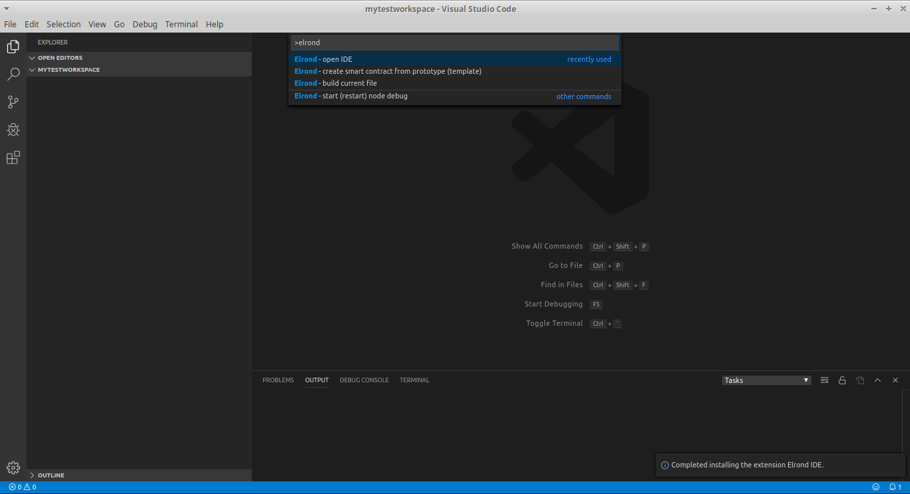
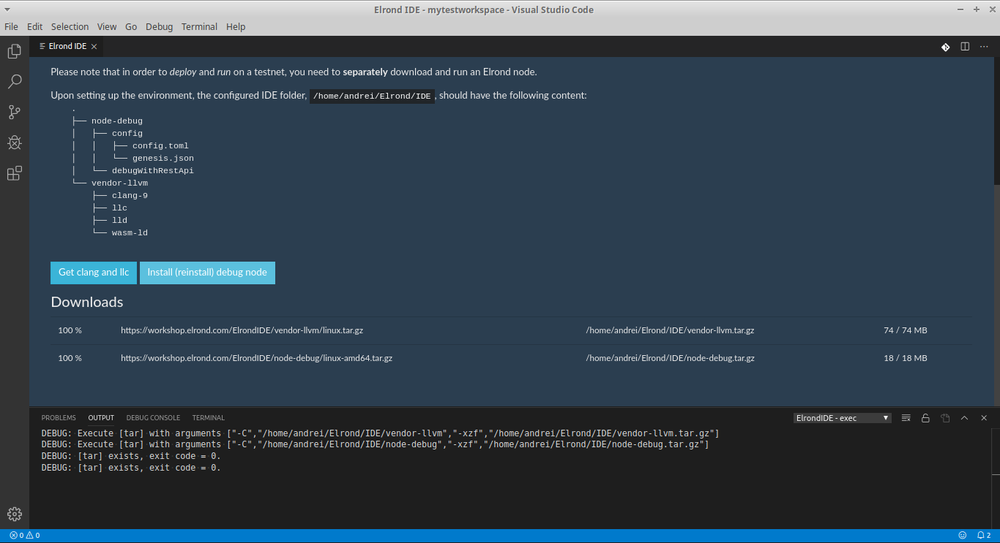
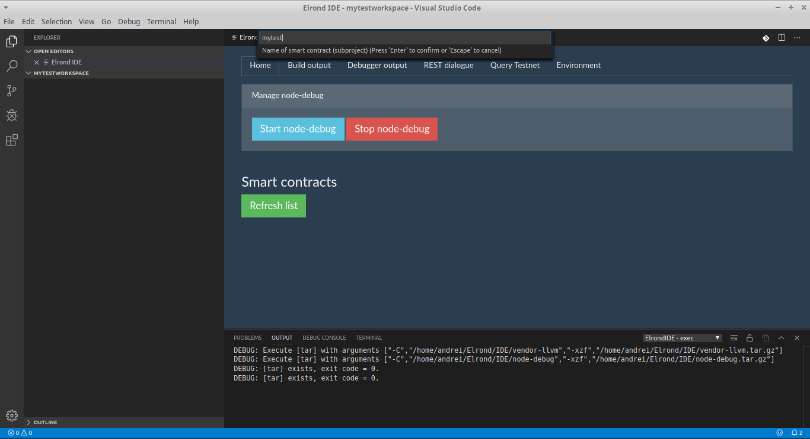
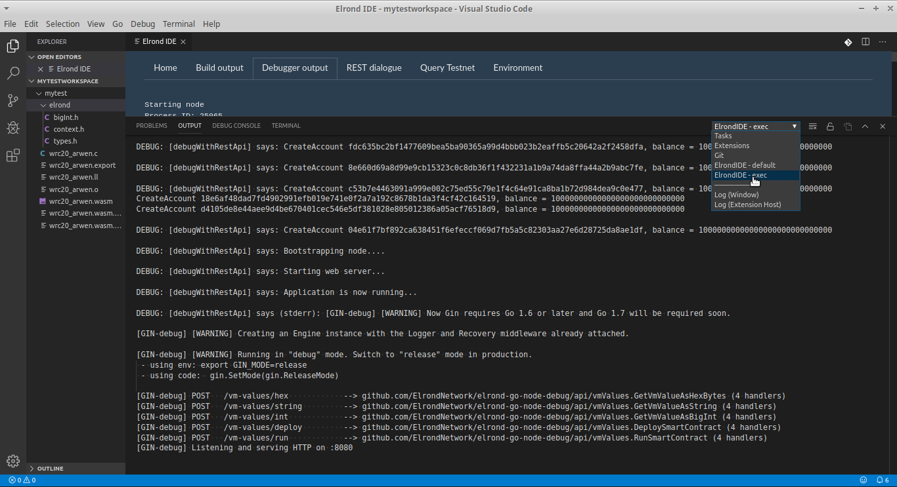
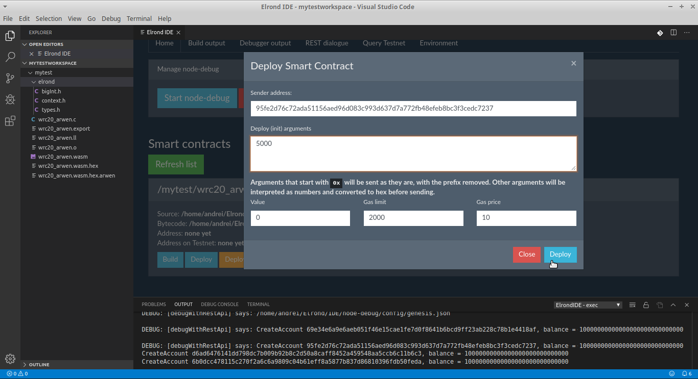
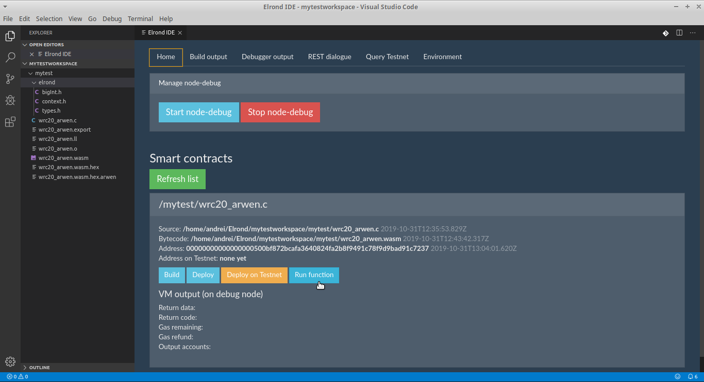
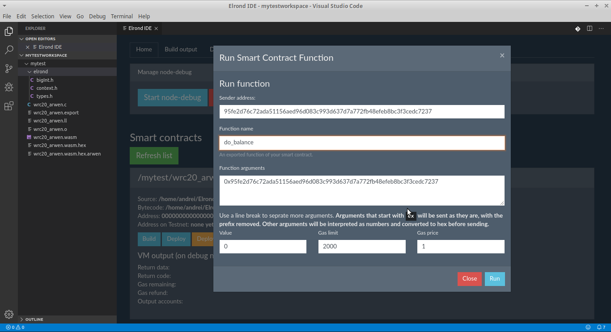
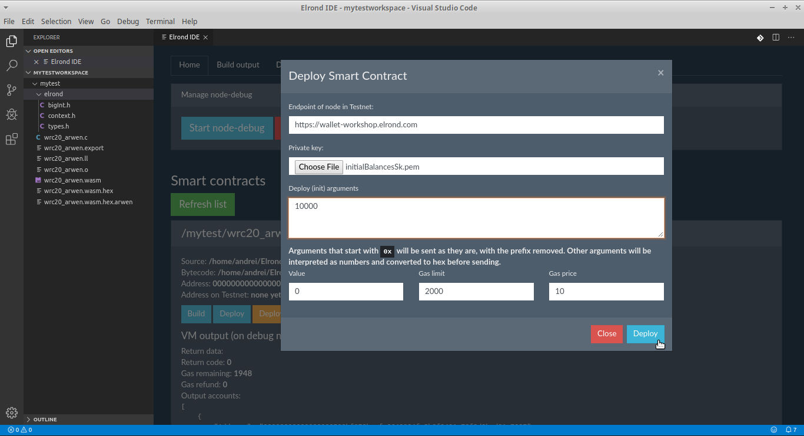

# San Francisco Blockchain Week 2019 Workshop

Welcome to the Elrond Network Workshop! 

This document will guide you through the following activities:

1. Install your own Elrond Node and connect it to the sandboxed Workshop Testnet created specifically for this Workshop;
2. Use the Elrond IDE extension for Visual Studio Code to develop, test and deploy your own SmartContract!

## Part 1: Installing the Elrond Node and connecting it to the Workshop Testnet

We prepared a sandboxed Workshop Testnet for your Elrond Node to be a part of during this Workshop. The Workshop Testnet already contains 20 Nodes managed by Elrond. These Nodes are connected as "Validators", which means they will be executing Transactions and SmartContracts, and they will be the ones generating the Blocks to be added to the Blockchain. Your Node, on the other hand, will connect to the Workshop Testnet as an Observer, not as a Validator. This means that it will be continuously synchronized with the Workshop Testnet, but will not take part in the Block-producing Consensus process - that is a resource-intensive task and it is the responsibility of the Validators to fulfill.

The Elrond Node currently supports GNU/Linux and MacOS (Windows support is in development). Please follow the instructions below, choosing those pertaining to your OS. We made this process as easy as possible. Note that the last installation command for both OSes is an installation script. For details about what it does, see [The installation script](#the-installation-script) below.

In case you're running a GNU/Linux distribution *other* than Ubuntu or Debian you will have to substitute `apt-get` commands for their equivalent for your distribution. For example, on RHEL, Fedora and CentOS you should run `sudo dnf install -y git wget curl` instead.

Now, to begin the installation open your favorite terminal application and navigate to an empty directory that will serve as the workbench.

### Installing on GNU/Linux:

Some of the following commands will request root access using `sudo`. Make sure your user belongs to the `wheel` group before running them (to see the groups you currently belong, run `groups` in a terminal). 

In the open terminal application run these commands, one by one:
```
sudo apt-get install git wget curl -y
git clone https://github.com/ElrondNetwork/elrond-go-scripts --single-branch --branch sf2019
cd elrond-go-scripts/ubuntu-amd64/
./install.sh
```
After launching the last command, follow the on-screen instructions. 
* When prompted for a name for your Node, provide any memorable name you like.
* When prompted with `Options for starting your Elrond Node`, choose `front` to have the Elrond Node started using its informative real-time Terminal UI.

### Installing on MacOS:

Some of the following commands will request root access using `sudo`. You will also need `brew` before running the following commands. If you don't have `brew` on your system, see its [official website](https://brew.sh/).

In the open terminal application run these commands, one by one:

```
brew install git wget curl
git clone https://github.com/ElrondNetwork/elrond-go-scripts --single-branch --branch sf2019
cd elrond-go-scripts/darwin-amd64/
./install.sh
```
After launching the last command, follow the on-screen instructions. 
* When prompted for a name for your Node, provide any memorable name you like.
* When prompted with `Options for starting your Elrond Node`, choose `front` to have the Elrond Node started using its informative real-time Terminal UI.

### The installation script

The installation script we prepared for the Workshop will perform the following steps:
1. It downloads a `tar.gz` archive from https://github.com/ElrondNetwork/elrond-go/releases/tag/sf2019-1 which contains the following binaries: 
      - `node`: the Elrond Node executable;
      - `libwasmer_runtime_c_api`: a binary library used by the Node's Arwen VM to execute WASM SmartContracts.
      - `keygenerator`: a utility used to generate cryptographic credentials;
1. It will request root access using `sudo` to copy the `libwasmer_runtime_c_api` binary library into `/usr/lib` on GNU/Linux and into `/usr/local/lib` on Mac OS.
1. It downloads the repository https://github.com/ElrondNetwork/elrond-config/tree/sf2019, which contains configuration files used by the Elrond Node executable to connect to the Workshop Testnet;
1. It starts the Elrond Node and connects it to the Workshop Testnet.

### After the installation

The newly installed Elrond Node will now start synchronizing itself with the Workshop Testnet. Please give it a few minutes. Let it run in the background for the rest of the Workshop.

In case you need to start the Node again for some reason (you ran out of battery?), do the following:
1. Open your favorite terminal application
1. Navigate to the folder where you first performed the installation steps, then:
      - on GNU/Linux, `cd cd elrond-go-scripts/ubuntu-amd64/start_scripts`
      - on MacOs, `cd elrond-go-scripts/darwin-amd64/start_scripts`
1. Execute `./start.sh`

The Node will now start again. Give it a few moments to connect itself to the Workshop Testnet.


## Part 2: Developing SmartContracts

The Nodes of the Elrond Network support the execution of user-developed SmartContracts as part of Transactions. This means that anyone can write a SmartContract and publish it to the Elrond Network for other users to invoke. 

Writing and deploying a SmartContract to the Workshop Testnet is part of today's Workshop. To get started, you will need an IDE. Elrond has developed the Elrond IDE, an extension for Visual Studio Code which makes it easy to write your SmartContracts, execute them, test them and deploy them.

Please follow the instructions below to install and prepare the IDE.

### Visual Studio Code

If you don't have Visual Studio Code already, download and install it from here: https://code.visualstudio.com/download. Next, download the Elrond IDE extension for Visual Studio Code, packaged as a VSIX file, from
https://github.com/ElrondNetwork/vscode-elrond-c/releases/latest. From the list of Assets, choose the first: `vscode-elrond-ide-0.N.N.vsix`.

### The Elrond IDE extension

Next we'll install the Elrond IDE extension into Visual Studio Code:
1. Open Visual Studio Code.
1. Press `Ctrl+Shift+P` to open the VS Code command prompt.
1. Type in the word `vsix`
1. When the command `Extensions: Install from VSIX...` is selected, press Enter.

      

5. Browse to the downloaded VSIX file and select it.
5. Click the "Install" button.
5. Wait for the notification "Completed installing the extension Elrond IDE".
5. Restart Visual Studio Code.

### Preparing the Elrond IDE

We need to configure and prepare the IDE before its first use. We automated this process: the IDE will download all its dependencies and configure itself with a minimum of input from you. These dependencies are:
- A subset of the [LLVM](https://llvm.org) suite (namely `clang`, `llc`, `wasm-ld`).
- The [Elrond Debug Node](https://github.com/ElrondNetwork/elrond-go-node-debug), a lightweight version of the Elrond node, containing extra functionality dedicated to SsmartContract development. *This is not the same Node you installed in the first part of this document.*

First, we set up a folder to be used by the IDE for its dependencies:
1. Press `Ctrl+Shift+P` to open the VS Code command prompt (we'll do this a lot).
1. Type in the words `settings ui`.
1. When the command `Preferences: Open Settings (UI)` is selected, press Enter.
1. The `Settings` tab opens in VS Code and the textbox `Searc settings` is highlighted. Type in the word `elrond`.


5. We focus on the setting `Elrond: IDE Folder` (the rest must stay unchanged). Set this to a folder like `/<home>/<username>/Elrond/IDE`. Note that the settings are saved automatically as you type. When you're done, close the entire `Settings` tab.

Now we will make the IDE download and prepare its dependencies.
1. Press `Ctrl+Shift+P` to open the VS Code command prompt once again. 
1. Type in the words `elrond`, select the `Elrond - open IDE` command and press Enter.
 

 
3. Now click on the `Environment` tab and read the information it's giving you, just to make sure everything is OK.
 

 
4. Scroll downwards, where you'll see two buttons: `Get clang and llc` and `Install (reinstall) debug node`. 



5. Click them both, in any order. When you'll see the notifications `node-debug ready` and `LLVM tools ready to use`, it means the dependencies have been downloaded properly.

The result of these steps is that the configured IDE folder should have the following contents:
```
    .
    ├── node-debug
    │   ├── config
    │   │   ├── config.toml
    │   │   └── genesis.json
    │   └── debugWithRestApi
    └── vendor-llvm
        ├── clang-9
        ├── llc
        ├── lld
        └── wasm-ld
```

You should keep the `Elrond IDE` tab open for the duration of this Workshop because you'll use it a lot. In case you've closed it already: 
1. Press `Ctrl+Shift+P` to open the VS Code command prompt. 
1. Type in the words `elrond`, select the `Elrond - open IDE` command and press Enter.

As a final (yet important) step, we need to set up a home folder for our SmartContracts.
1. In Visual Studio Code, go to File > Open folder... 
1. Navigate to an empty folder where you'd like to keep your SmartContracts. We recommend creating `~/Desktop/SmartContracts` and opening it in VS Code.
 
We are now done preparing the IDE. Let's see how a SmartContract looks like.
 
### Writing SmartContracts

To get you started, we prepared a couple of SmartContract templates. We'll focus on an ERC20-like SmartContract for now. Let's create a SmartContract from the template `erc20-c` bundled with the Elrond IDE.

1. Press `Ctrl+Shift+P`, type in the word `elrond` and select the command `Elrond - create smart contract from prototype (template)`.


2. You will be asked to pick the template from a list of given prototypes. Choose `erc20-c`.


3. Enter a name for your SmartContract.



4. A subfolder is created for your new SmartContract in the `SmartContracts` folder. You can explore its contents. The file containing the actual SmartContract code is the `.c` file within the subfolder of your SmartContract. Feel free to take a look.


Let's compile the SmartContract to WASM! You now need to tell the Elrond IDE to rescan your `SmartContracts` folder, to detect all the SmartContracts in it. For that, you need to go to the `Elrond IDE` tab. If it's not open, press `Ctrl+Shift+P` and run the command `Elrond - open IDE`.

1. In the `Elrond IDE` tab, click `Home`, then the `Refresh` button. You will see a list of the detected SmartContracts, including your newly created one.


2. Click the `Build` button to compile the SmartContact. A few more files will appear in your SmartContract subfolder: the `.wasm` file we're interested in, and a few others such as `.wasm.hex` and `.wasm.hex.arwen`.


3. Click `Build output` at the top of the `Elrond IDE` page to inspect the logs.


4. You can find the same information on the `Output` pane at the bottom of the screen if you select `ElrondIDE - exec` in the dropdown selector at the right of the `Output` pane.


Let's get the SmartContract to run. For that, we'll need the Debug Node.

1) On the `Elrond IDE` tab, go to `Home` and click the `Start node-debug` button. You should see a lot of text in the `Output` pane at the bottom, as well as the notification `node-debug started`.




2) On the `Elrond IDE` tab, go to `Debugger output` to inspect the logs. 


Our Debug Node is running and ready to accept commands. Let's deploy our SmartContract to the Debug Node (as the compiled WASM bytecode we built a few steps above).

1. In order to deploy the smart contract on the Debug Node, open the `Elrond IDE` tab and go to `Home`. In the list of SmartContracts, click the `Deploy` button (**not yet** `Deploy on Testnet`!).


2. A form will appear. We need to fill it in. 
      1. A good value for `Sender address` would be `18e6af48dad7fd4902991efb019e741e0f2a7a192c8678b1da3f4cf42c164519`. It's one of the addresses preconfigured in the Debug Node's `genesis.json`, therefore the Debug Node thinks it is a real account. This will be the **Owner** account of the SmartContract.
      1. In the textarea `Deploy (init) arguments` we should simply write `5000`. Why? Because our toy ERC20 contract is written in such a way as to accept as its only argument at deploy time the total amount of tokens it can work with.
      1. Leave the rest of the fields to their defaults, then confirm by clicking `Deploy`.



3. Inspect the address of the SmartContract (this is not the address of the Owner account). We will need it soon.


As noted before, inspect the output and logs of node-debug (from the `Debugger output` on the `Elrond IDE` tab or in the bottom panel of Visual Studio Code). You can also inspect the REST dialogue between the Elrond IDE and the HTTP endpoint of the Debug Node.


The SmartContract is now deployed to the Debug Node! This means that the Debug Node can now execute one of the functions of the SmartContract. Let's do that.

1. Go to `Home` on the `Elrond IDE` tab, scroll down to our SmartContract and click `Run function`.



3. A form will appear.
      1. In the `Sender address` field, paste this address (another valid debug address): `22c2e3721a6256a5891ba612ad55343dceb6655388176f981ab2885ed756d6fd`.
      1. In the `Function name` field, write `do_balance`. It's one of the functions of our SmartContract.
      1. The function `do_balance` expects a single argument: the address of the account we want to know the balance of. We want to know the balance of `22c2e3721a6256a5891ba612ad55343dceb6655388176f981ab2885ed756d6fd` (same as the `Sender address`, just in this case). **When pasting addresses or other hexadecimal numbers in the `Function arguments` textbox, always prefix them with `Ox`, so that the IDE knows not to encode it to hexadecimal** - normally, all arguments are encoded to hexadecimal.



After execution, inspect the output (vmOutput) of run.


Run another function of the smart contract. That is, let's run ``transfer_token``.


After execution, inspect the output (vmOutput) of run. Notice the storage updates. 


14) Now let's deploy the smart contract on the testnet. Hit **Deploy on testnet**.


Fill in the form, then hit **Deploy**. 

**Note that the sender account - who will own the smart contract - should already have a balance account in the testnet.**

The private key should be the `txSign` PEM file.



Inspect the address of the smart contract.


15) Since the smart contract is now deployed on the **testnet**, you can **run** an exported function. Hit **Run function on Testnet**.


Fill in the form, then hit **Run**. Let's run ``transfer_token``.


After execution, let's check the balances of the owner account, and the account we've sent tokens to. In order to do this, we'll use the query form in the **Query Testnet** tab.


