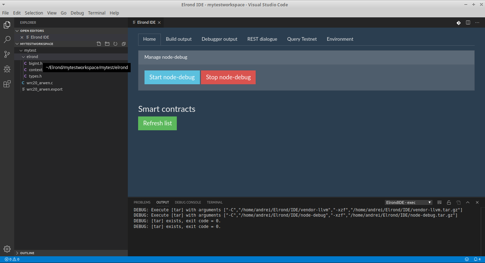

# San Francisco Blockchain Week 2019 Workshop

Welcome to the Elrond Network Workshop! 

This document will guide you through the following activities:

1. Install your own Elrond Node and connect it to the sandboxed Workshop Testnet created specifically for this Workshop;
2. Use the Elrond IDE extension for Visual Studio Code to develop, test and deploy your own SmartContract!

## Part 1: Installing the Elrond Node and connecting it to the Workshop Testnet

We prepared a sandboxed Workshop Testnet for your Elrond Node to be a part of during this Workshop. The Workshop Testnet already contains 20 Nodes managed by Elrond. These Nodes are connected as "Validators", which means they will be executing Transactions and SmartContracts, and they will be the ones generating the Blocks to be added to the Blockchain. Your Node, on the other hand, will connect to the Workshop Testnet as an Observer, not as a Validator. This means that it will be continuously synchronized with the Workshop Testnet, but will not take part in the Block-producing Consensus process - that is a resource-intensive task and it is the responsibility of the Validators to fulfill.

The Elrond Node currently supports GNU/Linux and MacOS (Windows support is in development). Please follow the instructions below, choosing those pertaining to your OS. We made this process as easy as possible. Note that the last installation command for both OSes is an installation script. For details about what it does, see [The installation script](#the-installation-script) below.

In case you're running a GNU/Linux distribution *other* than Ubuntu or Debian you will have to substitute `apt-get` commands for their equivalent for your distribution. For example, on RHEL, Fedora and CentOS you should run `sudo dnf install -y git wget curl` instead.

Now, to begin the installation open your favorite terminal application and navigate to an empty directory that will serve as the workbench.

### Installing on GNU/Linux:

Some of the following commands will request root access using `sudo`. Make sure your user belongs to the `wheel` group before running them (to see the groups you currently belong, run `groups` in a terminal). 

In the open terminal application run these commands, one by one:
```
sudo apt-get install git wget curl -y
git clone https://github.com/ElrondNetwork/elrond-go-scripts --single-branch --branch sf2019
cd elrond-go-scripts/ubuntu-amd64/
./install.sh
```
After launching the last command, follow the on-screen instructions. 
* When prompted for a name for your Node, provide any memorable name you like.
* When prompted with `Options for starting your Elrond Node`, choose `front` to have the Elrond Node started using its informative real-time Terminal UI.

### Installing on MacOS:

Some of the following commands will request root access using `sudo`. You will also need `brew` before running the following commands. If you don't have `brew` on your system, see its [official website](https://brew.sh/).

In the open terminal application run these commands, one by one:

```
brew install git wget curl
git clone https://github.com/ElrondNetwork/elrond-go-scripts --single-branch --branch sf2019
cd elrond-go-scripts/darwin-amd64/
./install.sh
```
After launching the last command, follow the on-screen instructions. 
* When prompted for a name for your Node, provide any memorable name you like.
* When prompted with `Options for starting your Elrond Node`, choose `front` to have the Elrond Node started using its informative real-time Terminal UI.

### The installation script

The installation script we prepared for the Workshop will perform the following steps:
1. It downloads a `tar.gz` archive from https://github.com/ElrondNetwork/elrond-go/releases/tag/sf2019-1 which contains the following binaries: 
      - `node`: the Elrond Node executable;
      - `libwasmer_runtime_c_api`: a binary library used by the Node's Arwen VM to execute WASM SmartContracts.
      - `keygenerator`: a utility used to generate cryptographic credentials;
1. It will request root access using `sudo` to copy the `libwasmer_runtime_c_api` binary library into `/usr/lib` on GNU/Linux and into `/usr/local/lib` on Mac OS.
1. It downloads the repository https://github.com/ElrondNetwork/elrond-config/tree/sf2019, which contains configuration files used by the Elrond Node executable to connect to the Workshop Testnet;
1. It starts the Elrond Node and connects it to the Workshop Testnet.

### After the installation

The newly installed Elrond Node will now start synchronizing itself with the Workshop Testnet. Please give it a few minutes. Let it run in the background for the rest of the Workshop.

In case you need to start the Node again for some reason (you ran out of battery?), do the following:
1. Open your favorite terminal application
1. Navigate to the folder where you first performed the installation steps, then:
      - on GNU/Linux, `cd cd elrond-go-scripts/ubuntu-amd64/start_scripts`
      - on MacOs, `cd elrond-go-scripts/darwin-amd64/start_scripts`
1. Execute `./start.sh`

The Node will now start again. Give it a few moments to connect itself to the Workshop Testnet.


## Part 2: Developing SmartContracts

The Nodes of the Elrond Network support the execution of user-developed SmartContracts as part of Transactions. This means that anyone can write a SmartContract and publish it to the Elrond Network for other users to invoke. 

Writing and deploying a SmartContract to the Workshop Testnet is part of today's Workshop. To get started, you will need an IDE. Elrond has developed the Elrond IDE, an extension for Visual Studio Code which makes it easy to write your SmartContracts, execute them, test them and deploy them.

Please follow the instructions below to install and prepare the IDE.

### Visual Studio Code

If you don't have Visual Studio Code already, download and install it from here: https://code.visualstudio.com/download. Next, download the Elrond IDE extension for Visual Studio Code, packaged as a VSIX file, from
https://github.com/ElrondNetwork/vscode-elrond-c/releases/latest. From the list of Assets, choose the first: `vscode-elrond-ide-0.N.N.vsix`.

### The Elrond IDE extension

Next we'll install the Elrond IDE extension:
1. Open Visual Studio Code.
1. Press `Ctrl+Shift+P` to open the VS Code command prompt.
1. Type in the word `vsix`
1. When the command `Install from VSIX` is selected, press Enter.

      

5. Browse to the downloaded VSIX file and select it.
6. Click the "Install" button.
7. Wait for the notification "Completed installing the extension Elrond IDE".
8. Restart Visual Studio Code.

### Configuring Elrond IDE

4) Adjust settings: `Ctrl+Shift+P`, command `open settings (UI)`. Search for `elrond*` settings. They are as follows:

- Elrond - download mirror: `https://workshop.elrond.com/ElrondIDE`
- **Elrond - IDE folder**: `/home/someone/Elrond/ide`
- Elrond - rest api port: `8080`
- Elrond - testnet URL: `https://wallet-workshop.elrond.com`

**You only need to set `Elrond - IDE folder`. Note that dependencies will be downloaded to this folder.** 


5) In Visual Studio Code, open a folder (workspace). This is where development of smart contracts will take place. `Ctrl+Shift+P`, command `Open Folder`.

6) Open **Elrond IDE**: `Ctrl+Shift+P`, command `Elrond - open IDE`.


7) Go to tab **Environment**, and install dependencies (automatically):
- A subset of [LLVM](https://llvm.org) suite (`clang`, `llc`, `wasm-ld`).
- [elrdon-do-node-debug](https://github.com/ElrondNetwork/elrond-go-node-debug), a lightweight version of the Elrond node, necessary for smart contract development.

**All these will be installed in the configured IDE folder.**


Upon setting up the environment, the configured IDE folder should have the following content:

```
    .
    ├── node-debug
    │   ├── config
    │   │   ├── config.toml
    │   │   └── genesis.json
    │   └── debugWithRestApi
    └── vendor-llvm
        ├── clang-9
        ├── llc
        ├── lld
        └── wasm-ld
```

8) Create a smart contract from an existing list of prototypes (templates). `Ctrl+Shift+P`, command `Elrond - create smart contract from prototype (template)`.


You will be asked to pick the prototype (template) from a list of given prototypes. Choose `erc20-c`.


Then, you shall provide a name for the smart contract subproject.


In the end, a folder is created for you in the workspace.




9) Go to **Home** tab. Hit **Refresh** to list the `.c` smart contracts in the workspace.


You should see the newly created smart contract project in the list.

10) Hit **Build** to obtain the WASM bytecode.


In addition to the `.wasm` file, other files are created as well, such as: `.wasm.hex`, `wasm.hex.arwen`.

Go to **Build output** to inspect the logs.


Also, you can go to the **Output channel** called **ElrondIDE - exec** to inspect the logs.


11) From the **Home** tab, **start node-debug**.


Go to **Debugger output** to inspect the logs.


Also, you can go to the **Output channel** called **ElrondIDE - exec** to inspect the logs.


12) In order to deploy the smart contract on node-debug, hit **Deploy**.


Fill in the form, then hit **Deploy**. Note that the sender account - who will own the smart contract - should already exist in `genesis.json` file of `node-debug`.


Inspect the address of the smart contract.


As noted before, inspect the output and logs of node-debug (from the tab **Debugger output** or from the `Output channel` of Visual Studio Code).

Inspect the REST dialogue between the vscode extension and the HTTP endpoint of node-debug.


13) Since the smart contract is now deployed on the **node-debug**, you can **run** an exported function. Hit **Run function**.


Fill in the form, then hit **Run**. Note the **0x** prefix of the function argument. This instructs the IDE to not double hex-encode the parameter. Let's run ``do_balance`` for the account that owns the smart contract.


After execution, inspect the output (vmOutput) of run.


Run another function of the smart contract. That is, let's run ``transfer_token``.


After execution, inspect the output (vmOutput) of run. Notice the storage updates. 


14) Now let's deploy the smart contract on the testnet. Hit **Deploy on testnet**.


Fill in the form, then hit **Deploy**. 

**Note that the sender account - who will own the smart contract - should already have a balance account in the testnet.**

The private key should be the `txSign` PEM file.


Inspect the address of the smart contract.


15) Since the smart contract is now deployed on the **testnet**, you can **run** an exported function. Hit **Run function on Testnet**.


Fill in the form, then hit **Run**. Let's run ``transfer_token``.


After execution, let's check the balances of the owner account, and the account we've sent tokens to. In order to do this, we'll use the query form in the **Query Testnet** tab.


