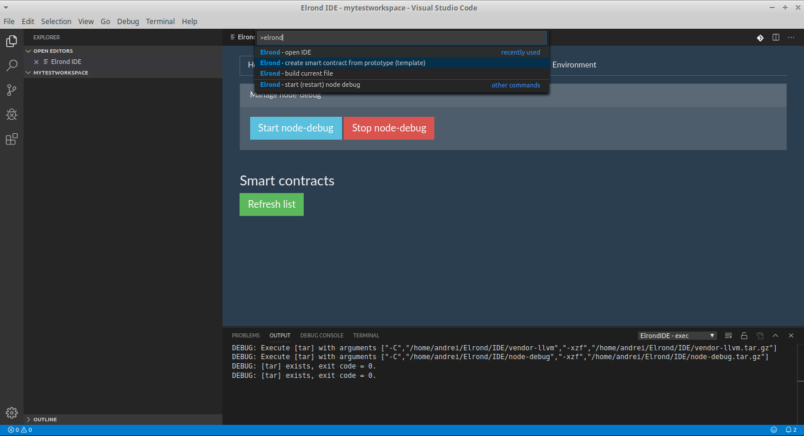
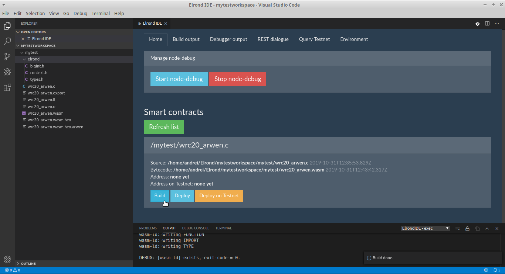
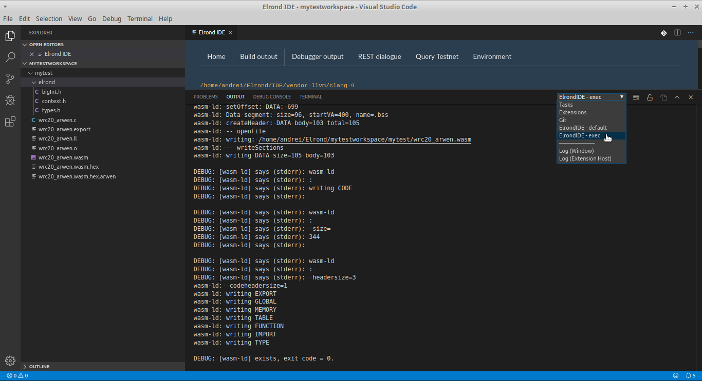
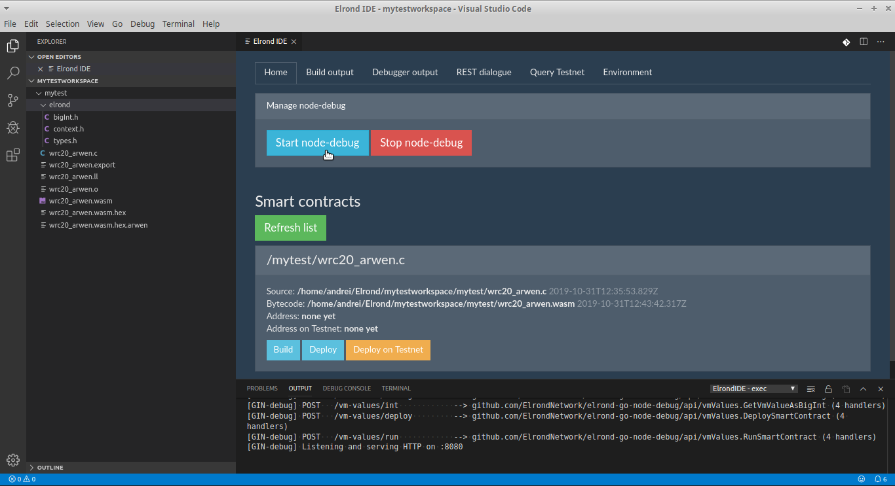
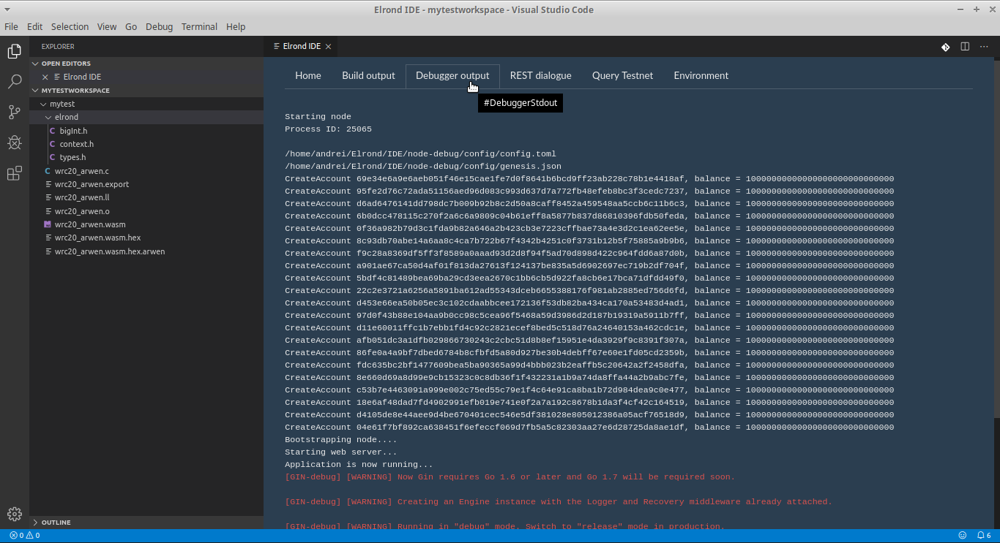
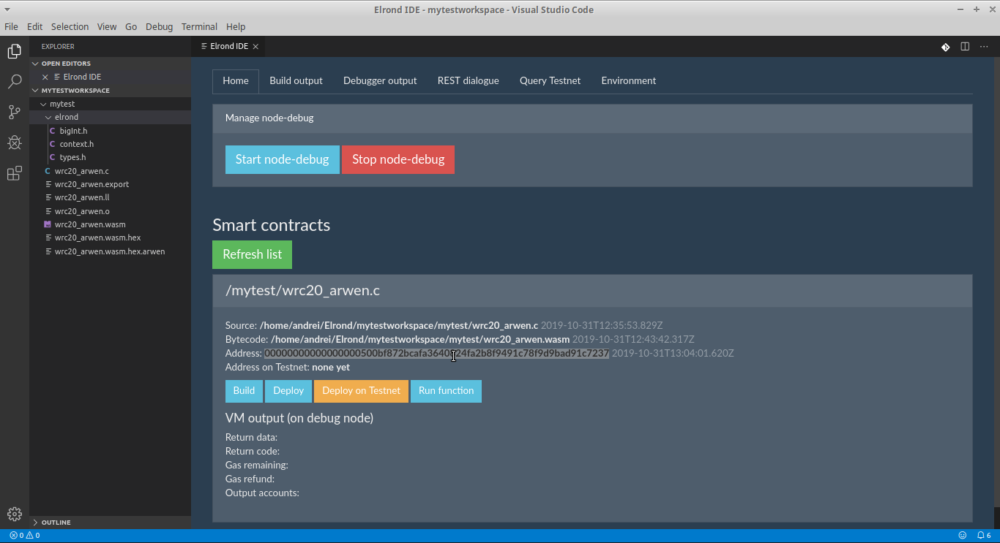
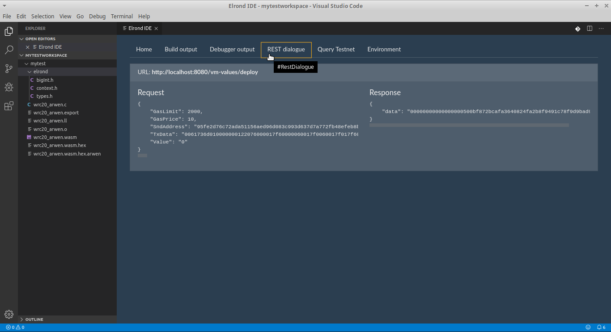

# San Francisco Blockchain Week 2019 Workshop

Welcome to the Elrond Network Workshop! 

This document will guide you through the following activities:

1. Install your own Elrond Node and connect it to the sandboxed Workshop Testnet created specifically for this Workshop;
2. Use the Elrond IDE extension for Visual Studio Code to develop, test and deploy your own SmartContract!

## Part 1: Installing the Elrond Node and connecting it to the Workshop Testnet

We prepared a sandboxed Workshop Testnet for your Elrond Node to be a part of during this Workshop. The Workshop Testnet already contains 20 Nodes managed by Elrond. These Nodes are connected as "Validators", which means they will be executing Transactions and SmartContracts, and they will be the ones generating the Blocks to be added to the Blockchain. Your Node, on the other hand, will connect to the Workshop Testnet as an Observer, not as a Validator. This means that it will be continuously synchronized with the Workshop Testnet, but will not take part in the Block-producing Consensus process - that is a resource-intensive task and it is the responsibility of the Validators to fulfill.

The Elrond Node currently supports GNU/Linux and MacOS (Windows support is in development). Please follow the instructions below, choosing those pertaining to your OS. Note that the last installation command for both OSes is an installation script. For details about what it does, see [The installation script](#the-installation-script) below.

Now, to begin the installation open your favorite terminal application and navigate to an empty directory that will serve as the workbench.

### Installing on GNU/Linux:

Some of the following commands will request root access using `sudo`. Make sure your user belongs to the `wheel` group before running them (to see the groups you currently belong, run `groups` in a terminal). 

Open a terminal and run these commands, one by one:
```
sudo apt-get install git wget curl -y
git clone https://github.com/ElrondNetwork/elrond-go-scripts --single-branch --branch sf2019
cd elrond-go-scripts/ubuntu-amd64/
./install.sh
```

After launching the last command, follow the on-screen instructions. 
* When prompted for a name for your Node, provide any memorable name you like.
* When prompted with `Options for starting your Elrond Node`, choose `front` to have the Elrond Node started using its informative real-time Terminal UI.

### Installing on MacOS:

Some of the following commands will request root access using `sudo`.

You will also need `brew` before running the following commands. If you don't have `brew` on your system, see its [official website](https://brew.sh/).

```
brew install git wget curl
git clone https://github.com/ElrondNetwork/elrond-go-scripts --single-branch --branch sf2019
cd elrond-go-scripts/darwin-amd64/
./install.sh
```
After launching the last command, follow the on-screen instructions. 
* When prompted for a name for your Node, provide any memorable name you like.
* When prompted with `Options for starting your Elrond Node`, choose `front` to have the Elrond Node started using its informative real-time Terminal UI.

### The installation script

The installation script we prepared for the Workshop will perform the following steps:
1. It downloads a `tar.gz` archive from https://github.com/ElrondNetwork/elrond-go/releases/tag/sf2019-1 which contains the following binaries: 
      - `node`: the Elrond Node executable;
      - `libwasmer_runtime_c_api`: a binary library used by the Node's Arwen VM to execute WASM SmartContracts.
      - `keygenerator`: a utility used to generate cryptographic credentials;
1. It will request root access using `sudo` to copy the `libwasmer_runtime_c_api` binary library into `/usr/lib` on GNU/Linux and into `/usr/local/lib` on Mac OS.
1. It downloads the repository https://github.com/ElrondNetwork/elrond-config/tree/sf2019, which contains configuration files used by the Elrond Node executable to connect to the Workshop Testnet;
1. It starts the Elrond Node and connects it to the Workshop Testnet.

### After the installation

The newly installed Elrond Node will now start synchronizing itself with the Workshop Testnet. Please give it a few minutes.


## Part 2: Developing SmartContracts:

1) Download and install VSCode from here: https://code.visualstudio.com/download

2) Download latest released VSIX file (Visual Studio Code extension):
https://github.com/ElrondNetwork/vscode-elrond-c/releases/

3) Install VSIX file in vscode.
`Ctrl+Shift+P`, command `Install from VSIX`. Select the downloaded VSIX file. Install, restart vscode.


4) Adjust settings: `Ctrl+Shift+P`, command `open settings (UI)`. Search for `elrond*` settings. They are as follows:

- Elrond - download mirror: `https://workshop.elrond.com/ElrondIDE`
- **Elrond - IDE folder**: `/home/someone/Elrond/ide`
- Elrond - rest api port: `8080`
- Elrond - testnet URL: `https://wallet-workshop.elrond.com`

**You only need to set `Elrond - IDE folder`. Note that dependencies will be downloaded to this folder.** 


5) In Visual Studio Code, open a folder (workspace). This is where development of smart contracts will take place. `Ctrl+Shift+P`, command `Open Folder`.

6) Open **Elrond IDE**: `Ctrl+Shift+P`, command `Elrond - open IDE`.


7) Go to tab **Environment**, and install dependencies (automatically):
- A subset of [LLVM](https://llvm.org) suite (`clang`, `llc`, `wasm-ld`).
- [elrdon-do-node-debug](https://github.com/ElrondNetwork/elrond-go-node-debug), a lightweight version of the Elrond node, necessary for smart contract development.

**All these will be installed in the configured IDE folder.**


Upon setting up the environment, the configured IDE folder should have the following content:

```
    .
    ├── node-debug
    │   ├── config
    │   │   ├── config.toml
    │   │   └── genesis.json
    │   └── debugWithRestApi
    └── vendor-llvm
        ├── clang-9
        ├── llc
        ├── lld
        └── wasm-ld
```

8) Create a smart contract from an existing list of prototypes (templates). `Ctrl+Shift+P`, command `Elrond - create smart contract from prototype (template)`.



You will be asked to pick the prototype (template) from a list of given prototypes. Choose `erc20-c`.


Then, you shall provide a name for the smart contract subproject.


In the end, a folder is created for you in the workspace.


9) Go to **Home** tab. Hit **Refresh** to list the `.c` smart contracts in the workspace.


You should see the newly created smart contract project in the list.

10) Hit **Build** to obtain the WASM bytecode.



In addition to the `.wasm` file, other files are created as well, such as: `.wasm.hex`, `wasm.hex.arwen`.

Go to **Build output** to inspect the logs.


Also, you can go to the **Output channel** called **ElrondIDE - exec** to inspect the logs.



11) From the **Home** tab, **start node-debug**.



Go to **Debugger output** to inspect the logs.



Also, you can go to the **Output channel** called **ElrondIDE - exec** to inspect the logs.


12) In order to deploy the smart contract on node-debug, hit **Deploy**.


Fill in the form, then hit **Deploy**. Note that the sender account - who will own the smart contract - should already exist in `genesis.json` file of `node-debug`.


Inspect the address of the smart contract.



As noted before, inspect the output and logs of node-debug (from the tab **Debugger output** or from the `Output channel` of Visual Studio Code).

Inspect the REST dialogue between the vscode extension and the HTTP endpoint of node-debug.



13) Since the smart contract is now deployed on the **node-debug**, you can **run** an exported function. Hit **Run**.


Fill in the form, then hit **Run**. Note the **0x** prefix of the function argument. This instructs the IDE to not double hex-encode the parameter. Let's run ``do_balance`` for the account that owns the smart contract.


After execution, inspect the output (vmOutput) of run.


Run another function of the smart contract. That is, let's run ``transfer_token``.


After execution, inspect the output (vmOutput) of run. Notice the storage updates. 


16) Start a node on the testnet.
./node


17) Hit "deploy on testnet" and choose the appropriate private key file. Then hit "deploy".


18) Inspect the address of the smart contract.


19) Run a function on the testnet. Don't forget to choose the appropriate private key file.


20) Inspect balance of the account that ran the function.
Open testnet explorer and check account balance
